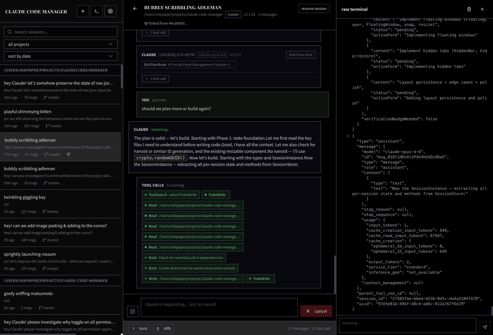

# Claude Code Manager

A web-based session browser for [Claude Code](https://docs.anthropic.com/en/docs/claude-code) conversations. Browse, search, and fork sessions stored in your local `~/.claude/` directory.



## Features

- **Browse sessions** — View all Claude Code conversations across projects
- **Search & filter** — Find sessions by content, project, slug, or session ID
- **Markdown rendering** — Syntax-highlighted code blocks and GitHub-flavored markdown
- **Resume sessions** — Get the CLI command to continue any session
- **Fork conversations** — Branch off at any message to explore a different direction, preserving full context up to that point

## Prerequisites

- Node.js (with ES2022 support)
- npm 7+ (for workspaces)
- Existing Claude Code session history (`~/.claude/`)

## Getting Started

```bash
# Install dependencies
npm install

# Run in development mode (server + client concurrently)
npm run dev
```

The client runs at `http://localhost:5173` and proxies API requests to the server on port `3899`.

## Production

```bash
# Build both server and client
npm run build

# Start the production server
npm start
```

The production server serves the built client as static files from port `3899`.

## Tech Stack

**Server:** Express 5, TypeScript, Node.js
**Client:** React 18, Vite, MobX, react-markdown, rehype-highlight
**Monorepo:** npm workspaces with shared TypeScript config

## Project Structure

```
├── server/
│   └── src/
│       ├── index.ts              # Express app entry point
│       ├── routes/
│       │   ├── sessions.ts       # GET /sessions, GET /sessions/:id, POST fork
│       │   └── launch.ts         # POST resume
│       └── services/
│           ├── claude-data.ts    # Reads ~/.claude session data
│           ├── forker.ts         # Session forking logic
│           └── launcher.ts      # Resume command generation
├── client/
│   └── src/
│       ├── App.tsx               # Root component
│       ├── stores/
│       │   └── SessionStore.ts   # MobX state management
│       └── components/
│           ├── Layout.tsx        # Two-column layout
│           ├── SearchBar.tsx     # Search and filter controls
│           ├── SessionList.tsx   # Session list sidebar
│           └── SessionDetail.tsx # Conversation viewer with fork buttons
├── tsconfig.base.json            # Shared TypeScript config
└── package.json                  # Workspace root
```
